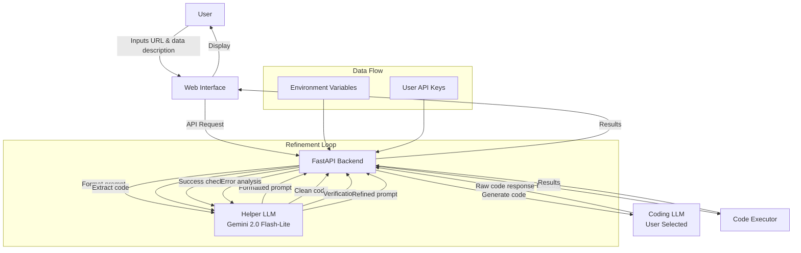
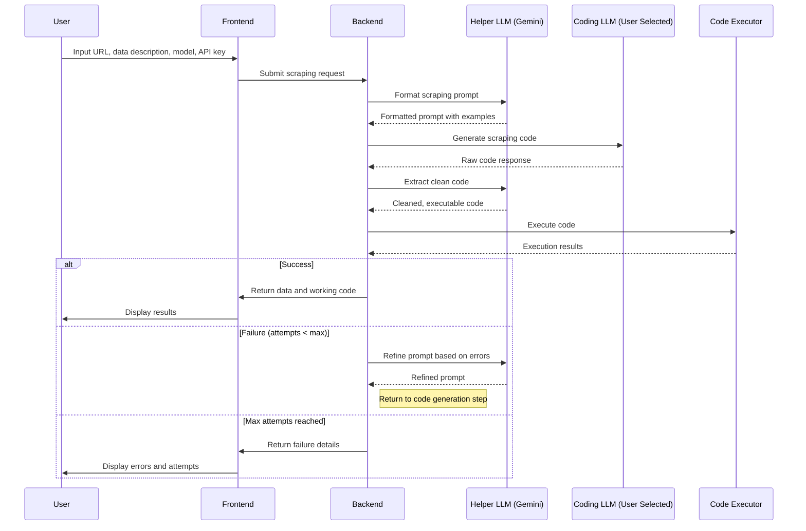

# Auto Web Scraper: Complete Project Documentation

## Table of Contents
1. [Project Overview](#project-overview)
2. [Architecture](#architecture)
3. [Detailed Workflow](#detailed-workflow)
4. [File Structure](#file-structure)
5. [Component Explanation](#component-explanation)
6. [Implementation Status](#implementation-status)
7. [Environment Setup](#environment-setup)
8. [Usage Guide](#usage-guide)
9. [Future Enhancements](#future-enhancements)

## Project Overview

Auto Web Scraper is an intelligent tool that leverages Large Language Models (LLMs) to automatically generate, test, and refine web scraping code based on natural language descriptions. It creates a bridge between simple user requirements and working Python code, making web scraping accessible to users without programming expertise.

The system uses two LLMs:
1. **Helper LLM** (Gemini 2.0 Flash-Lite): Handles prompt formatting, code extraction, and error analysis
2. **Coding LLM** (User-selected): Generates the actual web scraping code

This dual-LLM approach allows for:
- More efficient task distribution
- Cost optimization (helper model is cheaper)
- Specialized handling of different parts of the workflow

## Architecture



The architecture follows a client-server model:
- **Frontend**: Simple HTML/CSS interface for input and results display
- **Backend**: FastAPI application handling the core workflow
- **LLM Integration**: LangChain for standardized interactions with different LLM providers
- **Code Execution**: Secure sandbox environment for testing generated code

## Detailed Workflow

The scraping process follows these steps:

1. **User Input**
   - URL to scrape
   - Description of data to extract
   - Selection of coding LLM
   - API key for the selected LLM
   - Maximum number of refinement attempts

2. **Prompt Formatting** (Helper LLM)
   - Creates a structured request for the coding LLM
   - Includes example output format
   - Adds specifics about the website and data to extract

3. **Code Generation** (Coding LLM)
   - Generates Python code based on the formatted prompt
   - Includes imports, error handling, and data extraction logic
   - Formats output according to provided examples

4. **Code Extraction** (Helper LLM)
   - Extracts clean code from the LLM response
   - Removes explanations, comments, and markdown formatting
   - Validates that the code looks like valid Python

5. **Code Execution**
   - Runs the code in a secure sandbox
   - Handles necessary imports and dependencies
   - Captures output, errors, and execution metrics

6. **Success Verification**
   - Analyzes execution results
   - Checks for errors and meaningful output
   - Determines if scraping was successful

7. **Refinement Loop** (If Needed)
   - Analyzes errors and output from failed attempts
   - Creates refined prompts addressing specific issues
   - Generates improved code
   - Repeats until success or maximum attempts reached

8. **Result Presentation**
   - Displays extracted data
   - Shows the working code
   - Provides execution history and diagnostics



## File Structure

```
auto-scraper/
├── app/
│   ├── __init__.py
│   ├── main.py                  # FastAPI application entry point
│   ├── api/
│   │   ├── __init__.py
│   │   └── endpoints.py         # API endpoints for scraping
│   ├── models/
│   │   ├── __init__.py
│   │   └── schemas.py           # Pydantic data models
│   ├── services/
│   │   ├── __init__.py
│   │   ├── llm_service.py       # LLM integration service
│   │   ├── prompt.py            # Prompt templates
│   │   ├── scraper.py           # Core code execution engine
│   │   └── scraper_helper.py    # Helper functions for scraper
│   └── utils/
│       ├── __init__.py
│       ├── config.py            # Configuration settings
│       └── logger.py            # Logging setup
├── static/
│   └── css/
│       └── style.css            # Custom styling
├── templates/
│   ├── error.html               # Error page template
│   ├── index.html               # Home page template
│   └── results.html             # Results page template
├── logs/                        # Log files directory
├── .env                         # Environment variables
├── .gitignore                   # Git ignore file
├── Dockerfile                   # Docker configuration
├── README.md                    # Project overview
├── AUTO_WEB_SCRAPER.md          # This detailed documentation
├── requirements.txt             # Python dependencies
├── run.bat                      # Windows startup script
└── run.sh                       # Linux/Mac startup script
```

## Component Explanation

### Core Components

#### 1. LLM Service (`app/services/llm_service.py`)
The LLM service manages interactions with both the helper and coding LLMs:

- **Setup Methods**:
  - `setup_helper_llm()`: Configures the Gemini helper LLM
  - `setup_coding_llm(model, api_key)`: Sets up the user-selected coding LLM

- **Key Functions**:
  - `format_scraping_prompt()`: Creates structured prompt with examples
  - `extract_code_from_response()`: Cleans raw LLM responses into executable code
  - `generate_scraping_code()`: Gets code from the coding LLM
  - `refine_code_with_error()`: Creates error-based refinement prompts
  - `check_success()`: Validates scraping results

- **Model Mapping**: Translates user-friendly model names to API-specific names

#### 2. Scraper (`app/services/scraper.py`)
The scraper handles secure code execution and analysis:

- **Core Function**: `execute_code(code_string, timeout)` runs code in a sandbox
- **Security Features**: Resource limiting, dependency controls, chroot isolation
- **Error Analysis**: Specialized detection of web scraping-specific errors
- **Code Improvement**: Syntax fixing, code formatting, dependency management

#### 3. Scraper Helper (`app/services/scraper_helper.py`)
Helper functions for the scraper:

- **Wrapper Function**: `execute_code_wrapper()` ensures consistent return format
- **Example Generation**: `generate_example_output()` creates data-specific examples
- **Code Validation**: `test_code_format()` verifies code structure before execution

#### 4. API Endpoints (`app/api/endpoints.py`)
The FastAPI endpoints that orchestrate the workflow:

- **Main Endpoint**: `/scrape` handles the complete scraping process
- **Parameters**: Supports `max_attempts` for configurable refinement cycles
- **Error Handling**: Proper HTTP error responses with detailed messages

### Data Models

#### Request Model (`ScrapeRequest`)
```python
class ScrapeRequest(BaseModel):
    url: HttpUrl
    expected_data: str
    llm_model: str
    api_key: str
```

#### Response Model (`ScrapeResponse`)
```python
class ScrapeResponse(BaseModel):
    success: bool
    data: Optional[Any]
    code: Optional[str]
    attempts: int
    execution_results: List[CodeExecutionResult]
```

#### Execution Result Model (`CodeExecutionResult`)
```python
class CodeExecutionResult(BaseModel):
    stdout: str
    stderr: str
    success: bool
    execution_time: float
    fix_methods: List[str] = []
    formatted_code: Optional[str] = None
    scraping_issues: Optional[List[ScrapingIssue]] = None
    scraper_type: Optional[str] = None
```

### Frontend Templates

The frontend consists of three main templates:

1. **Index Page** (`templates/index.html`)
   - Input form for URL, data description, LLM model, API key
   - Model selection dropdown with options for different providers
   - Max attempts configuration

2. **Results Page** (`templates/results.html`)
   - Displays extracted data
   - Shows the working code
   - Provides execution history for all attempts
   - Includes tabbed interface for viewing each attempt's details

3. **Error Page** (`templates/error.html`)
   - Shows error details when processing fails
   - Provides troubleshooting guidance
   - Includes model-specific information when relevant

## Implementation Status

The project is in a **fully functional MVP state** with the following components completed:

✅ **Core Functionality**:
- LLM integration with multiple providers
- Code generation and execution
- Iterative refinement loop
- Data extraction and presentation

✅ **User Interface**:
- Input form with model selection
- Results display with code highlighting
- Error handling and guidance
- Attempt configuration

✅ **Error Handling**:
- Syntax error detection and fixing
- Web scraping-specific error analysis
- Platform-compatible logging
- Detailed error reporting

✅ **Security Features**:
- Secure code execution sandbox
- API key handling
- Dependency management
- Resource limitations

🔄 **In Progress**:
- Improved success detection for edge cases
- More robust JSON extraction from mixed outputs
- Enhanced error categorization for better refinement

## Environment Setup

### Prerequisites
- Python 3.9+
- API keys for LLM providers
- Git (for version control)

### Installation

1. **Clone the repository**:
   ```bash
   git clone https://github.com/yourusername/auto-web-scraper.git
   cd auto-web-scraper
   ```

2. **Create and activate a virtual environment**:
   ```bash
   # For Windows
   python -m venv venv
   venv\Scripts\activate
   
   # For Linux/Mac
   python -m venv venv
   source venv/bin/activate
   ```

3. **Install dependencies**:
   ```bash
   pip install -r requirements.txt
   ```

4. **Install Playwright browsers**:
   ```bash
   playwright install
   ```

5. **Configure environment variables**:
   Create a `.env` file with your API keys and configuration:
   ```
   # Helper LLM API key (for Gemini)
   GOOGLE_API_KEY=your_google_api_key_here
   
   # Security settings
   SECRET_KEY=your_random_secret_key
   
   # App settings
   DEBUG=True
   MAX_ATTEMPTS=3
   DEFAULT_EXECUTION_TIMEOUT=60
   ```

6. **Run the application**:
   ```bash
   # For Windows
   run.bat
   
   # For Linux/Mac
   ./run.sh
   
   # Or directly
   uvicorn app.main:app --reload --host 0.0.0.0 --port 8000
   ```

7. **Access the web interface**:
   Open a browser and navigate to `http://localhost:8000`

## Usage Guide

### Basic Usage

1. Enter the URL of the website you want to scrape
2. Describe the data you want to extract (be specific)
3. Select your preferred LLM model for code generation
4. Enter your API key for the selected model
5. Set the maximum number of refinement attempts (default: 3)
6. Click "Generate & Run Scraper"
7. Wait for the system to process your request
8. View the extracted data and generated code

### Tips for Best Results

1. **Be Specific**: The more specific your data description, the better the generated code
2. **Start Simple**: Begin with simple extraction tasks before attempting complex ones
3. **Model Selection**: Different models have different strengths:
   - GPT-4 often produces the most robust code
   - Claude excels at following formatting instructions
   - Gemini is good at handling complex website structures
4. **Attempts**: 3-5 attempts is usually optimal for most websites

### Troubleshooting

If you encounter issues:

1. **Check Logs**: Review the logs for detailed error information
2. **API Keys**: Verify your API key is correct and has necessary permissions
3. **Website Complexity**: Some websites use anti-scraping measures that may require manual tweaking
4. **Output Format**: If the output is not as expected, try providing a more explicit format example in your data description

## Future Enhancements

Planned improvements for the project:

1. **Enhanced Model Support**:
   - Add support for more LLM providers
   - Optimize prompts for each model's strengths
   - Implement model-specific refinement strategies

2. **Advanced Scraping Capabilities**:
   - Session management and cookie handling
   - Pagination support
   - JavaScript rendering options
   - More robust anti-detection measures

3. **User Experience**:
   - Visual element selector for point-and-click data selection
   - Saved scraper templates for quick reuse
   - Scheduled scraping jobs
   - Result export in multiple formats

4. **Performance Optimization**:
   - Caching for repeated requests
   - Parallel execution for multiple sites
   - Memory usage optimization for large sites

5. **Enterprise Features**:
   - User authentication and access control
   - API rate limiting and quota management
   - Project sharing and collaboration
   - Integration with data pipeline tools

---

This documentation represents the current state of the Auto Web Scraper project as of March 2025. The project is actively maintained and improved based on user feedback and technological advancements in the LLM space.